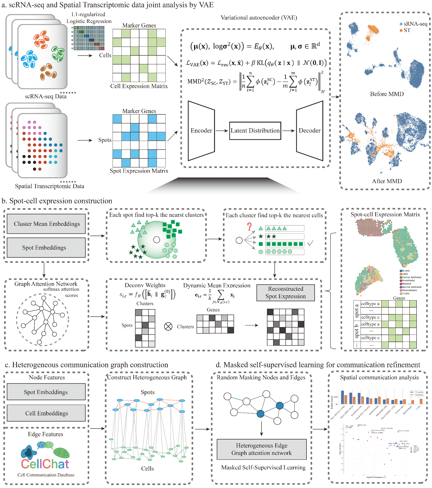

# Spagraph

Spagraph is a three-stage framework for joint single-cell and spatial
transcriptomics analysis. It integrates the two modalities with a variational
autoencoder (Stage 1), estimates spot-level cell composition and reconstructed
expression with a graph attention network (Stage 2), and prioritizes spatial
ligand-receptor communication with a heterogeneous graph model (Stage 3).



## Installation

Spagraph was developed with Python 3.10 and a CUDA-enabled PyTorch environment.
For library use, install the package and its declared dependencies:

```bash
git clone https://github.com/KuangQuanS/Spagraph.git
cd Spagraph
python -m venv .venv
source .venv/bin/activate  # Windows: .venv\Scripts\activate
python -m pip install --upgrade pip
python -m pip install -e .
```

The exact software versions used for the manuscript are pinned in
[`requirements-paper.txt`](requirements-paper.txt). Install the CUDA build of
PyTorch appropriate for your system before installing that file. The looser
ranges in `pyproject.toml` are the supported library dependencies; the pinned
file is for manuscript reproduction.

## Three-stage quick start

```python
from pathlib import Path
import spagraph as spg

sc_file = "data/single_cell.h5ad"
st_file = "data/spatial.h5ad"
deconv_dir = Path("outputs/deconv")
cellcom_dir = Path("outputs/cellcom")

# Stage 1: joint scRNA-seq/ST representation learning.
artifacts = spg.vae(
    sc_file=sc_file,
    st_file=st_file,
    output_dir=str(deconv_dir),
    resolution=4.0,
    seed=42,
)

# Stage 2: spatial deconvolution. A list triggers auto-k selection.
deconv_result = spg.deconv(
    vae=artifacts,
    st_file=st_file,
    output_dir=str(deconv_dir),
    k_celltype=[20, 25, 30, 35, 40],
    k_cells_per_cluster=15,
    save_reconstructed_genes=True,
    seed=42,
)

# Stage 3: spatial cell-cell communication.
spg.cellcom(
    deconv_dir=str(deconv_dir),
    st_h5ad=st_file,
    output_dir=str(cellcom_dir),
    n_spot_neighbors=8,
    ligand_expr_threshold=3.0,
    receptor_expr_threshold=3.0,
    epochs=200,
    seed=42,
    export_unified_csv=True,
)
```

Stage 1 returns an in-memory `Stage1Artifacts` object. When `output_dir` is
provided it also writes the run configuration and modality-alignment plots.
Stage 2 writes `*_composition.csv`, configuration and training diagnostics;
`save_reconstructed_genes=True` additionally writes the
`*_spot_cell_expr.csv` file required by Stage 3. Stage 3 writes filtered or
unified LR communication tables and model diagnostics under its output
directory.

## Inputs and outputs

- Stage 1 inputs: an scRNA-seq `.h5ad` and an ST `.h5ad` with genes as
  variables; the spatial object must contain coordinates in `obsm["spatial"]`.
- Stage 2 input: the Stage 1 artifact plus the ST file. The principal output is
  a spot-by-cluster composition table.
- Stage 3 inputs: the ST file, Stage 2 composition table, reconstructed
  spot-cell expression, and the bundled `cellchat_human.csv` LR database.
- Generated data, checkpoints and manuscript result tables are intentionally
  not versioned. Dataset paths are supplied as command-line arguments in the
  reproduction entry points.

## Manuscript datasets and reproduction

The manuscript evaluates 32 simulated mixtures, STARmap, seqFISH+, four tumour
case studies (HGSOC, PDAC, DCIS and cSCC), semisynthetic and fully synthetic LR
benchmarks, and a Visium HD colorectal cancer case study. Dataset-specific
entry points are under [`run_notebook/`](run_notebook/); evaluation and figure
code is under [`evaluate/scripts/`](evaluate/scripts/); reusable benchmark
logic is under [`spagraph/analysis/`](spagraph/analysis/). A curated script map
and explicit scope exclusions are provided in
[`docs/reproduction.md`](docs/reproduction.md).

The exact run parameters, their provenance and all recorded simulated-data
auto-k values are available in:

- [`docs/parameters.md`](docs/parameters.md) — reviewable parameter tables and
  provenance notes.
- [`docs/parameters.xlsx`](docs/parameters.xlsx) — the same release record in
  spreadsheet form.

Figure 3e uses one LR pair as the statistical unit. An LR pair selected by both
top-15 lists is excluded from both groups before the two-sided Mann-Whitney U
tests; the two prespecified P values are Holm-adjusted. The implementation and
tests are in
[`spagraph/analysis/figure3e_statistics.py`](spagraph/analysis/figure3e_statistics.py)
and [`tests/test_figure3e_statistics.py`](tests/test_figure3e_statistics.py).

## Reproducibility notes

- The package seed is 42 unless a manuscript entry point records another seed.
- Paths in public scripts are repository-relative or passed as CLI arguments;
  raw data are not redistributed.
- Stage 3 requires Stage 2 to be run with `save_reconstructed_genes=True`.
- The manuscript environment is a reproducibility snapshot, not a claim that
  every pinned package combination is required for basic library use.

## License

Spagraph is released under the [MIT License](LICENSE).
